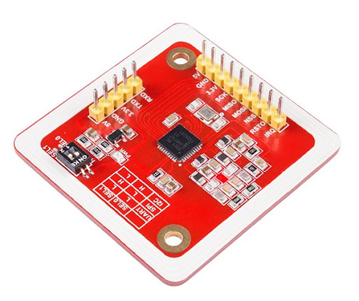
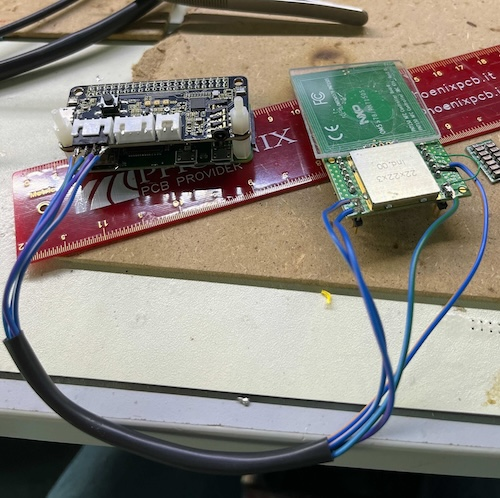

# Favolotto


## Hardware

- [Raspberry Pi Zero 2 W](https://www.raspberrypi.com/products/raspberry-pi-zero-2-w/) or [Raspberry Pi Zero W](https://www.raspberrypi.com/products/raspberry-pi-zero-w/)
- [Keyestudio 5V ReSpeaker 2-Mic Pi HAT V1.0](https://www.keyestudio.com/products/keyestudio-5v-respeaker-2-mic-pi-hat-v10-expansion-board-for-raspberry-pi-3b-4b)
- PN532 NFC reader
- 3 Watt speaker
- MicroSD card
- Power bank
- Adehesive NFC tags (Ntag 215)
- 3D printed case

## Software

Use [Raspberry Pi Imager](https://www.raspberrypi.com/software/) to prepare the MicroSD card with the Raspberry Pi OS Lite 64bit, using custom setup to configure wireless settings. Also, enable SSH.
Boot the Rpi with the SD card inserted and connecto to it through SSH.
Run `sudo raspi-config`and enable I2C (`Interface Options > I2C`). Don't forget to expand the filesystem from `Advanced Options > Expand Filesystem`.

### I2C

Before starting, enable I2C running `sudo raspi-config` and going to `Interface Options > I2C > Enable`, then reboot.  
You should then see the I2C module loaded with `lsmod | grep i2c`.

If not, try loading the modules manually:

```sh
sudo modprobe i2c-dev
sudo modprobe i2c-bcm2835
```

### Audio hat

Install the I2C package and check the sound hat is correctly detected (the detected value in the matrix could be different):

```sh
sudo apt install -y i2c-tools git
sudo i2cdetect -y 1

     0  1  2  3  4  5  6  7  8  9  a  b  c  d  e  f
00:                         -- -- -- -- -- -- -- --
10: -- -- -- -- -- -- -- -- -- -- 1a -- -- -- -- --
20: -- -- -- -- -- -- -- -- -- -- -- -- -- -- -- --
30: -- -- -- -- -- -- -- -- -- -- -- -- -- -- -- --
40: -- -- -- -- -- -- -- -- -- -- -- -- -- -- -- --
50: -- -- -- -- -- -- -- -- -- -- -- -- -- -- -- --
60: -- -- -- -- -- -- -- -- -- -- -- -- -- -- -- --
70: -- -- -- -- -- -- -- --
```

Install the hat drivers:

```sh
git clone https://github.com/waveshare/WM8960-Audio-HAT
cd WM8960-Audio-HAT/
sudo ./install.sh
```

Edit the configuration with `sudo vi /boot/firmware/config.txt` and add:

```
dtparam=audio=off # this is already present with "on", change it
dtoverlay=wm8960-soundcard
```

After `reboot`, you shoud see the sound card:

```sh
$ aplay -l

**** List of PLAYBACK Hardware Devices ****
card 0: wm8960soundcard [wm8960-soundcard], device 0: 3f203000.i2s-wm8960-hifi wm8960-hifi-0 [3f203000.i2s-wm8960-hifi wm8960-hifi-0]
  Subdevices: 1/1
  Subdevice #0: subdevice #0
card 1: vc4hdmi [vc4-hdmi], device 0: MAI PCM i2s-hifi-0 [MAI PCM i2s-hifi-0]
  Subdevices: 1/1
  Subdevice #0: subdevice #0
```

Copy an mp3 file to the Rpi and check it works with `mpg321 file.mp3` (`sudo apt install mpg321` if it is not available). If you don't hear anything, check the volume with `alsamixer` (use `m` to mute/unmute channels).

### NFC

#### PN532 module



Connect the module to the Rpi via I2C. The audio hat exposes the I2C port. Follow the correct order:

| PN532 | Raspberry Pi Zero    |
| ----- | -------------------- |
| VCC   | 3.3V (Pin 1)         |
| GND   | GND (Pin 6)          |
| SDA   | SDA1 - GPIO2 (Pin 3) |
| SCL   | SCL1 - GPIO3 (Pin 5) |

> **Do not forget to set the module to I2C changing the switches to 1-0.**

You should now see the device at the 0x24 or 0x48 address (0x24 in this example):

```sh
$ sudo i2cdetect -y 1

     0  1  2  3  4  5  6  7  8  9  a  b  c  d  e  f
00:                         -- -- -- -- -- -- -- --
10: -- -- -- -- -- -- -- -- -- -- UU -- -- -- -- --
20: -- -- -- -- 24 -- -- -- -- -- -- -- -- -- -- --
30: -- -- -- -- -- -- -- -- -- -- -- -- -- -- -- --
40: -- -- -- -- -- -- -- -- -- -- -- -- -- -- -- --
50: -- -- -- -- -- -- -- -- -- -- -- -- -- -- -- --
60: -- -- -- -- -- -- -- -- -- -- -- -- -- -- -- --
70: -- -- -- -- -- -- -- --
```

At this point you must configure the module editing the file `/etc/nfc/libnfc.conf`, adding/updating with:

```
allow_autoscan = true
device.connstring = "pn532_i2c:/dev/i2c-1"
# Uncomment the following line to enable verbose logging
#log_level = 3

```

Install the required packages:

```sh
sudo apt install libnfc6 libnfc-bin libnfc-dev libnfc-examples
```

Check the device:

```sh
$ nfc-list
nfc-list uses libnfc 1.8.0
NFC device:  opened
```

If everything is ok, you can try reading a tag with `nfc-poll`:

```sh
$ nfc-poll
nfc-poll uses libnfc 1.8.0
NFC reader:  opened
NFC device will poll during 36000 ms (20 pollings of 300 ms for 6 modulations)
ISO/IEC 14443A (106 kbps) target:
    ATQA (SENS_RES): 00  44
       UID (NFCID1): 04  82  28  3a  bf  2a  81
      SAK (SEL_RES): 00
Waiting for card removing...nfc_initiator_target_is_present: Target Released
done.
```

#### PN7150 module

Using the shield with the PN7150 follow the [reference guide](https://community.nxp.com/t5/NXP-Designs-Knowledge-Base/Easy-set-up-of-NFC-on-Raspberry-Pi/ta-p/1099034)

The reference code:

```
git clone https://github.com/NXPNFCLinux/linux_libnfc-nci.git
```

In this repo there are some example to use libnfc:

```
https://github.com/NXPNFCLinux/linux_libnfc-nci_examples
```

**Note**: demo and lib needs to have connected the Int pin.

#### NFC PN7150 Connection:


- Signal | Pin No.
- SDA -> GPIO 2
- SCL -> GPIO 3
- Vdd -> 3.3V
- GND -> GND
- Int -> GPIO23

### Result

This is an initial prototype:


