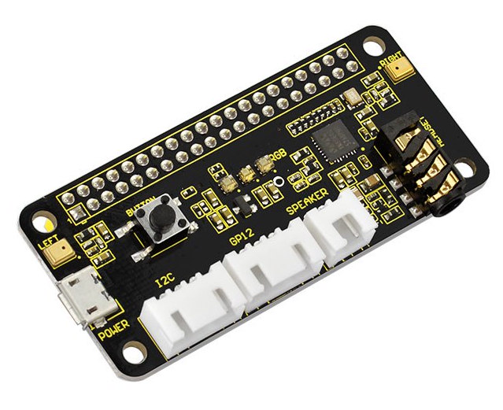

# Favolotto


Favolotto is a magical audio storyteller designed to spark children’s imagination.
Just place a story character on Favolotto, and the corresponding tale begins to play—automatically and effortlessly.  
With a simple and intuitive web interface, parents can easily upload new MP3 stories and link them to specific characters using NFC tags.  
While Favolotto is made with kids in mind, it's built on the versatile Raspberry Pi Zero platform, making it a powerful and flexible audio player that can bring any NFC-tagged audio content to life.

Favolotto is ready to use, but there's still plenty of work ahead. Here’s a list of features we’d like to develop next:

- Set the Raspberry Pi OS to read-only mode, except during file uploads.
- Enhance the UI to display additional details for each MP3 file, such as duration.
- Enable MP3 downloads directly from the UI.
- If the device is paused and a different tag is placed, the new file should start playing automatically.
- Stop playback a few seconds after a tag is removed, and resume from the same point if the same tag is placed again.
- Support multiple MP3 files per tag and allow track skipping via a button.
- Monitor battery level and play a warning sound when it's low.
- Play a short sound to indicate the system is ready after startup.
- Implement automatic shutdown or hibernation after a period of inactivity.
- Create an installer to setup the device

## Hardware

- [Raspberry Pi Zero 2 W](https://www.raspberrypi.com/products/raspberry-pi-zero-2-w/) or [Raspberry Pi Zero W](https://www.raspberrypi.com/products/raspberry-pi-zero-w/)
- [Keyestudio 5V ReSpeaker 2-Mic Pi HAT V1.0](https://www.keyestudio.com/products/keyestudio-5v-respeaker-2-mic-pi-hat-v10-expansion-board-for-raspberry-pi-3b-4b)
- PN532 or PN7150 NFC reader
- 3 Watt speaker
- MicroSD card
- Battery hat (optional)
- Adehesive NFC tags (Ntag 215)
- 3D printed case

Assembling favolotto is quite straightforward: the hat modules (audio and the optional battery hat) use the standard Rpi shield connections. The NFC module can be connected with 4 wires using the standard I2C connection. See the NFC paragraph below for details.

## Software

Use [Raspberry Pi Imager](https://www.raspberrypi.com/software/) to prepare the MicroSD card with the Raspberry Pi OS Lite 64bit, using custom setup to configure wireless settings. Also, enable SSH.
Boot the Rpi with the SD card inserted and connect to it through SSH.
Run `sudo raspi-config`and enable I2C (`Interface Options > I2C`). Don't forget to expand the filesystem from `Advanced Options > Expand Filesystem`.

### I2C

Before starting, enable I2C running `sudo raspi-config` and going to `Interface Options > I2C > Enable`, then reboot.  
You should then see the I2C module loaded with `lsmod | grep i2c`.

If not, try loading the modules manually:

```sh
sudo modprobe i2c-dev
sudo modprobe i2c-bcm2835
```

### Audio hat



Install the I2C package and check the sound hat is correctly detected (the detected value in the matrix could be different):

```sh
sudo apt install -y i2c-tools git

sudo i2cdetect -y 1

     0  1  2  3  4  5  6  7  8  9  a  b  c  d  e  f
00:                         -- -- -- -- -- -- -- --
10: -- -- -- -- -- -- -- -- -- -- 1a -- -- -- -- --
20: -- -- -- -- -- -- -- -- -- -- -- -- -- -- -- --
30: -- -- -- -- -- -- -- -- -- -- -- -- -- -- -- --
40: -- -- -- -- -- -- -- -- -- -- -- -- -- -- -- --
50: -- -- -- -- -- -- -- -- -- -- -- -- -- -- -- --
60: -- -- -- -- -- -- -- -- -- -- -- -- -- -- -- --
70: -- -- -- -- -- -- -- --
```

Install the hat drivers:

```sh
git clone https://github.com/waveshare/WM8960-Audio-HAT
cd WM8960-Audio-HAT/
sudo ./install.sh
```

> At the moment of writing (24th sept 2025) the main branch doesn't work with the 6.12 kernel.
> You can either try with the [6.12.x](https://github.com/waveshareteam/WM8960-Audio-HAT/tree/6.12.x) branch or [this fork](https://github.com/ubopod/WM8960-Audio-HAT)

Edit the configuration with `sudo vi /boot/firmware/config.txt` and add:

```
dtparam=audio=off # this is already present with "on", change it
dtoverlay=wm8960-soundcard
```

After `reboot`, you shoud see the sound card:

```sh
$ aplay -l

**** List of PLAYBACK Hardware Devices ****
card 0: wm8960soundcard [wm8960-soundcard], device 0: 3f203000.i2s-wm8960-hifi wm8960-hifi-0 [3f203000.i2s-wm8960-hifi wm8960-hifi-0]
  Subdevices: 1/1
  Subdevice #0: subdevice #0
card 1: vc4hdmi [vc4-hdmi], device 0: MAI PCM i2s-hifi-0 [MAI PCM i2s-hifi-0]
  Subdevices: 1/1
  Subdevice #0: subdevice #0
```

Copy an mp3 file to the Rpi and check it works with `mpg321 file.mp3` (`sudo apt install mpg321` if it is not available). If you don't hear anything, check the volume with `alsamixer` (use `m` to mute/unmute channels).

### NFC

#### PN532 module


Connect the module to the Rpi via I2C. The audio hat exposes the I2C port on its top. Follow the correct order:

| PN532 | Raspberry Pi Zero    |
| ----- | -------------------- |
| VCC   | 3.3V (Pin 1)         |
| GND   | GND (Pin 6)          |
| SDA   | SDA1 - GPIO2 (Pin 3) |
| SCL   | SCL1 - GPIO3 (Pin 5) |

> **Do not forget to set the NFC module to I2C changing the switches to 1-0.**

You should now see the device at the 0x24 or 0x48 address (0x24 in this example):

```sh
$ sudo i2cdetect -y 1

     0  1  2  3  4  5  6  7  8  9  a  b  c  d  e  f
00:                         -- -- -- -- -- -- -- --
10: -- -- -- -- -- -- -- -- -- -- UU -- -- -- -- --
20: -- -- -- -- 24 -- -- -- -- -- -- -- -- -- -- --
30: -- -- -- -- -- -- -- -- -- -- -- -- -- -- -- --
40: -- -- -- -- -- -- -- -- -- -- -- -- -- -- -- --
50: -- -- -- -- -- -- -- -- -- -- -- -- -- -- -- --
60: -- -- -- -- -- -- -- -- -- -- -- -- -- -- -- --
70: -- -- -- -- -- -- -- --
```

At this point you must configure the module editing the file `/etc/nfc/libnfc.conf`, adding/updating with:

```
allow_autoscan = true
device.connstring = "pn532_i2c:/dev/i2c-1"
# Uncomment the following line to enable verbose logging
#log_level = 3

```

Install the required packages:

```sh
sudo apt install libnfc6 libnfc-bin libnfc-dev libnfc-examples
```

Check the device:

```sh
$ nfc-list
nfc-list uses libnfc 1.8.0
NFC device:  opened
```

If everything is ok, you can try reading a tag with `nfc-poll`:

```sh
$ nfc-poll
nfc-poll uses libnfc 1.8.0
NFC reader:  opened
NFC device will poll during 36000 ms (20 pollings of 300 ms for 6 modulations)
ISO/IEC 14443A (106 kbps) target:
    ATQA (SENS_RES): 00  44
       UID (NFCID1): 04  82  28  3a  bf  2a  81
      SAK (SEL_RES): 00
Waiting for card removing...nfc_initiator_target_is_present: Target Released
done.
```

In the picture below you see another popular PN532 module, but beware that, given the position of the antenna around the other components, in my experience it doesn't work well (or doesn't work at all).


#### PN7150 module

Using the shield with the PN7150 follow the [reference guide](https://community.nxp.com/t5/NXP-Designs-Knowledge-Base/Easy-set-up-of-NFC-on-Raspberry-Pi/ta-p/1099034)

The reference code:

```
git clone https://github.com/NXPNFCLinux/linux_libnfc-nci.git
```

In this repo there are some example to use libnfc:

```
https://github.com/NXPNFCLinux/linux_libnfc-nci_examples
```

**Note**: demo and lib needs to have connected the Int pin.

#### NFC PN7150 Connection:


- Signal | Pin No.
- SDA -> GPIO 2
- SCL -> GPIO 3
- Vdd -> 3.3V
- GND -> GND
- Int -> GPIO23

#### Buttons:

- GPIO22 -> Button Left
- GPIO23 -> Button Middle
- GPIO24 -> Button Right

### Battery

I found two good options for the battery power:

#### UPS Lite V1.3 UPS Power HAT


The quality is very good, but the battery doesn't last very long (I would say it will last 2 or 3 evenings). I didn't find a way to check the battery level (I tried many options, none worked).

#### 18650 module


Way cheaper, needs batteries (use good quality batteries). Check you're getting the 5V version while buying.

### Backend software

The heart of Favolotto is the backend, written in Go. The last version for the Raspberry can be found on the [releases page](https://github.com/tommyblue/favolotto/releases). Depending on your raspberry you must use the correct version. Run `uname -m` on the rpi and identify the version to use.

You can cross compile the software yourself. First, [install go](https://go.dev/doc/install) on your system, then build it:

```sh
cd backend
GOOS=linux GOARCH=arm64 go build -ldflags="-s -w" ./cmd/favolotto
```

Depending on the output of `uname -m` you must use the following variables:

* armv6l (Pi Zero / 1): `GOARCH=arm, GOARM=6`
* armv7l (Pi 2 / 3 / 4, 32-bit OS): `GOARCH=arm, GOARM=7`
* aarch64 (Pi Zero 2, Pi 3 / 4 / 5, 64-bit OS): `GOARCH=arm64`

Once you get the favolotto binary, copy it on your rpi into `/usr/local/bin/favolotto`.

Create the configuration file and the required folders:

```sh
mkdir /etc/favolotto
mkdir -p /var/favolotto/store
```

Create the `/etc/favolotto/config.json` file with the following content (customize it at your needs):

```json
{
    "host": "127.0.0.1",
    "port": 3000,
    "store": "/var/favolotto/store",
    "development": false,
    "nfc_driver": "pn532"
}
```

For the `nfc_driver` field use either `pn532` or `pn7150` depending on your hardware.

In the [system/](./system) folder get the `favolotto.service` file and put it into `/etc/systemd/system/favolotto.service`. Then run:

```sh
daemon-reload
systemctl enable favolotto
systemctl start favolotto
```

Now the last step: install nginx as web proxy in front of the backend and the web UI:

```sh
sudo apt install nginx
```

Then get the [system/nginx.default_server](./system/nginx.default_server) file and copy it (or its content) to `/etc/nginx/sites-enabled/default`, then restart the service with `systemctl restart nginx`.

To check if the backend is working you can open the `http://<favolotto IP>/api/v1/songs` URL to get the songs list as a JSON response. Follow the next step to also get the web UI.

### Web UI

To build the frontend you need [NodeJS](https://nodejs.org), then:

```sh
cd frontend
npm ci
npm run build
```

At this point copy the content of the `dist/` folder into `/var/www/html`. 

Once everything is in place you can open the web interface just connecting to the Favolotto ip address using a browser.

If you place an NFC tag on the reader, you'll see the tag id on the web form. Copy that value on the input and add an mp3 file. Once the upload has completed, using the NFC tag will make Favolotto reproduce the mp3 file.

### 3D models

In the 3d folder you can find some useful models:

- **token:** it's the base of the story characters. It has a hole in the middle. In your preferred slicer pause the 3D print before the hole gets closed to insert an NFC token (I used [these tokens](https://it.aliexpress.com/item/1005006302799813.html))
- **stand:** you can print multiple stands and use them to build a wall of characters. See the picture above for an example.

These are some good characters models I found online:

- [Hungry Caterpillar](https://www.printables.com/model/32061-hungry-caterpillar-with-leaf-stand-mmu)
- [Gnome 1](https://www.printables.com/model/643048-holiday-gnome) - [Gnome 2](https://www.printables.com/model/342049-gnome-supportless)
- [Snow white](https://www.printables.com/model/1197280-funko-pop-snow-white)
- [Pig](https://www.printables.com/model/1126189-cute-pig)
- [Elf](https://www.printables.com/model/1058958-xmas-elf-2)
- [Cinderella](https://www.printables.com/model/378961-cinderella-slipper)
- [Aladdin's Genie](https://www.printables.com/model/148764-aladins-genie)
- [Nemo](https://www.printables.com/model/567445-nemo)
- [Elsa](https://www.printables.com/model/639198-elsa-princess-frozen)

### Result


